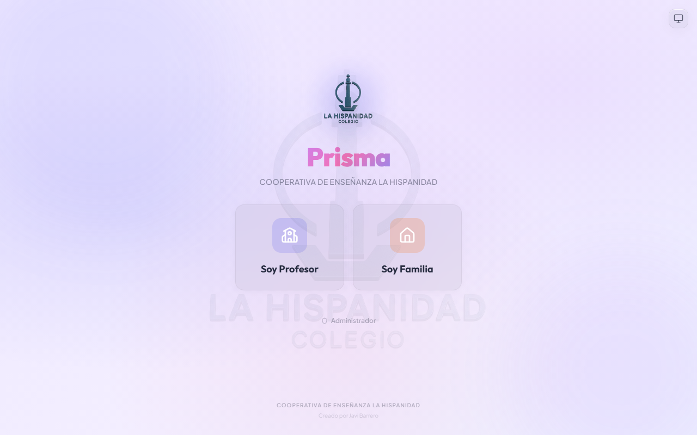
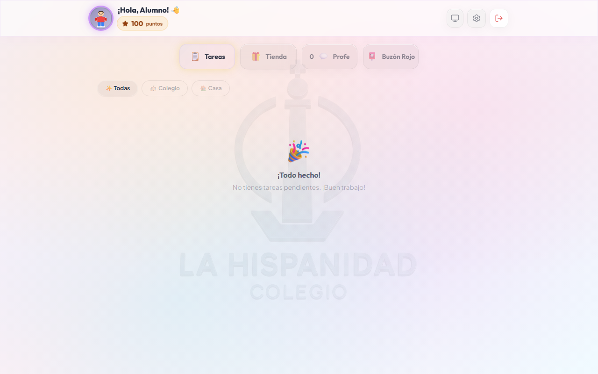
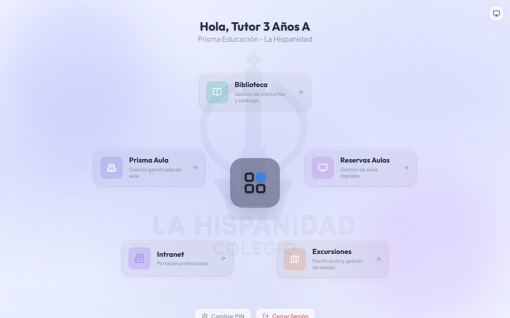
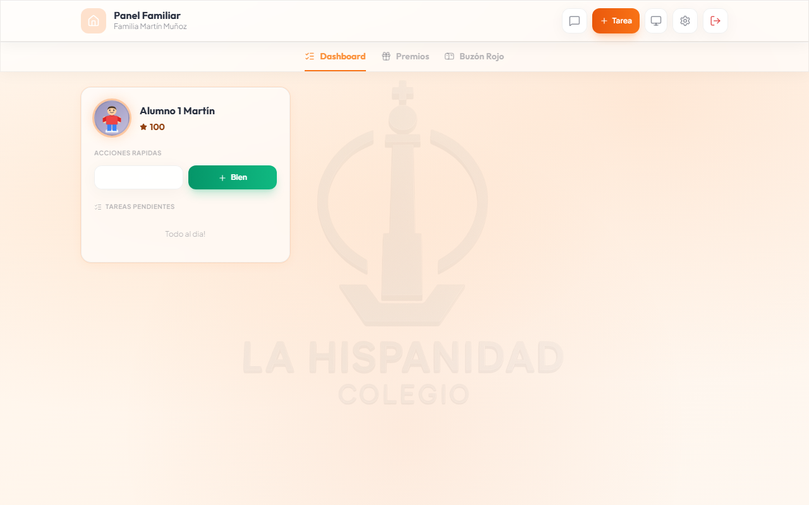
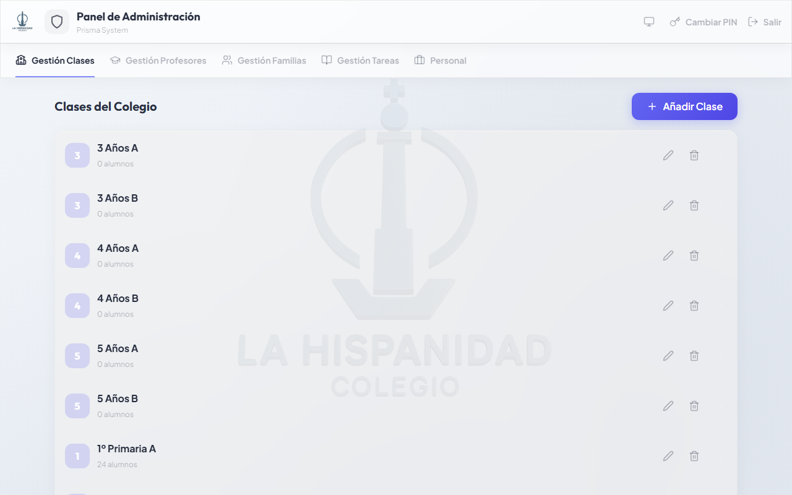

# PrismaEdu - Plataforma de Gestión Educativa Gamificada

PrismaEdu es el **portal central** de la Suite Educativa La Hispanidad. Actúa como proveedor de identidad (SSO) para todas las demás aplicaciones del ecosistema y como plataforma de gamificación del aula, conectando profesorado, familias y alumnado mediante tareas, recompensas, avatares y chat en tiempo real.

> **Acceso:** Todos los roles del colegio acceden a PrismaEdu. Es el único portal al que acceden familias y alumnado.

---

## 📸 Capturas de Pantalla

| Login — Selección de Rol | Alumno — Tareas |
|:---:|:---:|
|  |  |

| Alumno — Tienda de Recompensas | Tutor — Gestión de Clase |
|:---:|:---:|
|  |  |

| Familia — Dashboard | Administración — Gestión de Usuarios |
|:---:|:---:|
|  |  |

---

## 🚀 Funcionalidades por Público

### 🎓 Alumnado

- **Gestión de tareas**
  - Ver todas las tareas asignadas (escolares y de casa)
  - Filtrar por contexto (colegio/casa), prioridad y estado de completado
  - Completar tareas para acumular puntos
  - Recibir notificaciones emergentes cuando el tutor marca una tarea como "Misión Especial" (alta prioridad)

- **Tienda de recompensas**
  - Explorar recompensas escolares (creadas por el tutor) y de casa (creadas por las familias)
  - Sistema de rareza: Gratis → Común → Raro → Épico → Legendario
  - Canjear puntos por recompensas reales
  - Ver historial completo de canjes

- **Avatar personalizable**
  - Avatar compuesto por 6 capas independientes: base, pelo, parte superior, parte inferior, calzado y accesorio
  - Comprar ítems en la tienda de avatar con puntos ganados
  - Ver armario con todos los ítems disponibles y adquiridos

- **Mensajería**
  - Chat en tiempo real con el tutor de clase
  - Buzón escolar: enviar mensajes anónimos al tutor
  - Buzón familiar: enviar mensajes a los padres/madres
  - Ver respuestas recibidas y contador de mensajes no leídos

- **Configuración**
  - Cambiar PIN de acceso de 4 dígitos (siempre número primo)

---

### 🏠 Familias

- **Visión general de la familia**
  - Ver todos los hijos vinculados con sus puntos actuales y avatares

- **Gestión de recompensas de casa**
  - Crear, editar y eliminar recompensas de contexto doméstico
  - Definir coste en puntos y stock disponible
  - Monitorizar qué recompensas canjean los hijos

- **Gestión de tareas de casa**
  - Crear y asignar tareas del hogar a los hijos (ej. "Poner la mesa", "Ordenar la habitación")
  - Definir puntos por tarea y seguir el estado de completado

- **Mensajería**
  - Chat directo con el tutor de cada hijo
  - Recibir mensajes del buzón familiar (incluidos mensajes anónimos de los hijos)
  - Recibir notificaciones automáticas cuando el tutor asigna o retira puntos

---

### 👨‍🏫 Profesorado

- **Gestión del aula**
  - Ver todos los alumnos de la clase con avatares y puntos actuales
  - Sumar o restar puntos a alumnos individuales (con notificación automática a familias)
  - Acceder a la ficha detallada de cada alumno: puntos, avatar, tareas asignadas, historial de recompensas

- **Tareas escolares**
  - Crear tareas para toda la clase con tipo (trabajo en clase / deberes) y valor en puntos
  - Marcar tareas como "Alta Prioridad" (muestra popup al alumno al entrar)
  - Configurar recurrencia semanal por días de la semana
  - Activar modo tarea única (no repetible)

- **Tienda escolar**
  - Crear, editar y eliminar recompensas canjeables por los alumnos
  - Fijar coste en puntos, rareza y stock
  - Ver historial de canjes por alumno

- **Mensajería**
  - Chat individual con alumnos y con sus familias
  - Gestionar el buzón de sugerencias de la clase
  - Los mensajes de asignación de puntos se envían automáticamente a las familias

- **Accesos al ecosistema**
  - Accesos directos a Aulas, BiblioHispa, Excursiones e Intranet desde el dashboard

---

### 🏫 Dirección / Administración

- **Gestión completa de usuarios**
  - Crear, editar y eliminar usuarios de todos los roles (alumnos, tutores, familias, personal)
  - Importación masiva desde CSV con creación automática de familias y generación de PINs primos
  - Mover alumnos entre familias y clases
  - Exportar listados de usuarios
  - Cambiar PINs de cualquier usuario

- **Gestión de clases**
  - Crear, editar y eliminar clases
  - Vincular tutores a clases
  - Ver composición completa de cada clase
  - Importación masiva de alumnos a clases por CSV

- **Administración del sistema**
  - Gestionar roles del personal (ADMIN, DIRECCION, TESORERIA, COORDINACION)
  - Acceso y edición de todos los datos del sistema
  - Semilla y reinicio de base de datos (entorno de desarrollo: `npm run reset`)

- **Supervisión y analítica**
  - Estadísticas globales: usuarios totales, puntos distribuidos, tareas creadas
  - Filtrar por clase
  - Seguimiento de rendimiento por alumno y clase

- **Apariencia**
  - Cambiar tema global del sistema (claro/oscuro/automático)

---

## ⚙️ Características Técnicas

- **Backend:** Node.js + Express (CommonJS)
- **Base de datos:** SQLite (`database.sqlite`) con caché LRU en memoria
- **Autenticación:** PIN de 4 dígitos (alumnos/familias) + Google OAuth (`@colegiolahispanidad.es`)
- **Sincronización:** Socket.IO — eventos en tiempo real (`sync_users`, `sync_tasks`, `sync_classes`, `sync_messages`, etc.)
- **SSO:** Proveedor de identidad central para Aulas, BiblioHispa, Excursiones e Intranet
- **Diseño:** Sistema "Prismatic Glass" con glassmorfismo, soporte automático de temas claro/oscuro

---

## 🛠️ Instalación desde Cero (Ubuntu)

Sigue estos pasos para instalar PrismaEdu en un servidor Ubuntu limpio utilizando el script de instalación automatizado.

### 1. Clonar el repositorio

Accede a tu servidor vía SSH y clona el repositorio oficial:

```bash
git clone https://github.com/JohnnyBra/prismaedu.git
cd prismaedu
```

### 2. Ejecutar el script de instalación

Otorga permisos de ejecución y lanza el script de instalación automática. Este script se encargará de instalar todas las dependencias necesarias (Node.js, PM2, etc.), compilar el proyecto y configurar la base de datos.

```bash
chmod +x deploy/install.sh
./deploy/install.sh
```

El script realizará las siguientes acciones:
1.  Actualizar el sistema y paquetes.
2.  Instalar Node.js 20 si no está presente.
3.  Instalar PM2 para la gestión de procesos.
4.  Instalar las dependencias del proyecto (`npm install`).
5.  Compilar la aplicación para producción (`npm run build`).
6.  Inicializar la base de datos (`npm run reset`) si es una instalación nueva.
7.  Arrancar el servidor en el puerto **3020**.

---

## 🔄 Actualización

Para actualizar tu instalación con los últimos cambios del repositorio, utiliza el script de actualización incluido. Este script descarga los cambios, recompila el proyecto y reinicia el servicio sin perder tus datos.

```bash
cd prismaedu
chmod +x deploy/update.sh
./deploy/update.sh
```

---

## 💻 Desarrollo Local

Si deseas contribuir o probar la aplicación en tu máquina local:

1.  Clonar el repositorio:
    ```bash
    git clone https://github.com/JohnnyBra/prismaedu.git
    cd prismaedu
    ```
2.  Instalar dependencias:
    ```bash
    npm install
    ```
3.  **Modo Desarrollo (con Hot Reload):**
    ```bash
    # Inicia el frontend (Vite)
    npm run dev

    # En otra terminal, inicia el backend
    npm start
    ```
    *Nota: Asegúrate de que el frontend apunte al puerto correcto del backend (3020).*

4.  **Modo Producción (Prueba local):**
    ```bash
    npm run build
    npm start
    ```
